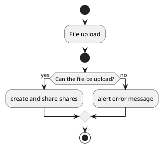
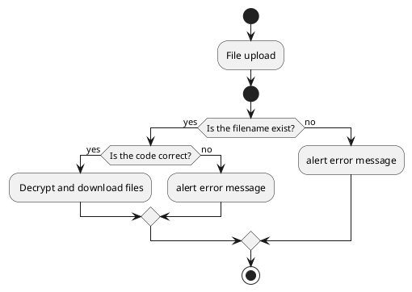

# ひみつるん

## 概要

ひみつるんは、秘密分散を利用した安全なファイル共有サイトです。
( K , N ) しきい値法に基づき、N個のシェア情報を作成し、K個入力することで元のファイルを取得できます。
サーバー側とユーザー側に1つずつシェア情報を保持することで、どちらか一方でシェア情報が漏えいしたとしても、元のファイルを取得できません。

## アクティビティ図

### アップロード概要

### ダウンロード概要

## 参考

- [A familiar HTTP Service Framework — responder 1.3.0 documentation](https://responder.readthedocs.io/en/latest/#)
- [Welcome to PyCryptodome’s documentation — PyCryptodome 3.9.4 documentation](https://pycryptodome.readthedocs.io/en/latest/index.html)
- [Python｜SQLAlchemyの使い方 - わくわくBank](https://www.wakuwakubank.com/posts/277-python-sqlalchemy/)
- [sql - SQLAlchemyがシリアル列を作成しないのはなぜですか？ - 答えた](https://kotaeta.com/57761810)
- [SQLAlchemy ORMの基本的な使い方 - Qiita](https://qiita.com/TamaiHideaki/items/346bf843ee6ee1aa6e93)
- [sqlalchemyを使用してpythonでDBアクセスをする - Qiita](https://qiita.com/mink0212/items/d7f31f6e2903c5f0b837)
- [Python+ResponderでWEBアプリケーションを構築する。 - Qiita](https://qiita.com/t-iguchi/items/5c4294efffbba9a6bb84#8download-file)
- [Fancy Bootstrap 4 File Upload Component - HTML&CSS Snippet](https://bootstrapious.com/p/bootstrap-file-upload)
- [Fixed top navbar example for Bootstrap](https://getbootstrap.com/docs/4.0/examples/navbar-fixed/)