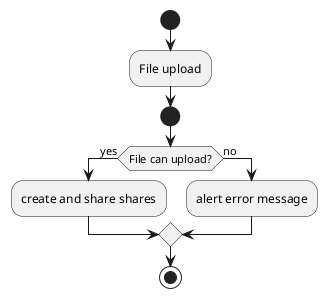

# ひみつるん

## 概要

ひみつるんは、秘密分散を利用した安全なファイル共有サイトです。
( K , N ) しきい値法に基づき、N個のシェア情報を作成し、K個入力することで元のファイルを取得できます。
サーバー側とユーザー側に1つずつシェア情報を保持することで、どちらか一方でシェア情報が漏えいしたとしても、元のファイルを取得できません。

## アクティビティ図

### アップロード概要

